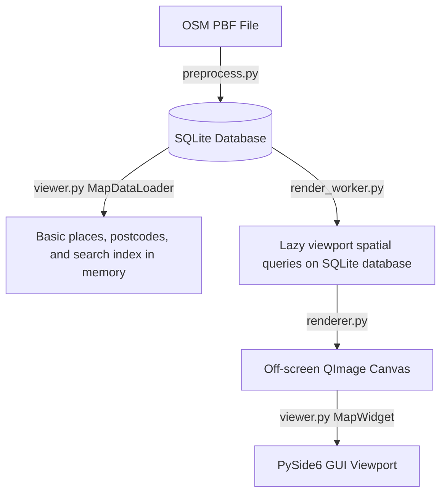

# Developer & Implementation Guide: Offline Map Viewer

> [!IMPORTANT]
> **CRITICAL PERSISTENT RULE: ALWAYS UPDATE THIS GUIDE AFTER THE CODE IS UPDATED.**
> This developer guide must be kept in sync with the codebase at all times. Whenever you make modifications to styling rules, preprocessing pipelines, database schemas, lazy loading viewport queries, routing engine algorithms, profiles in `config.json`, search systems, or rendering processes, update this document immediately.

---

## 1. Core Architecture Overview

The application is an offline map viewer that parses OpenStreetMap (OSM) data, compiles it into a lightweight SQLite database, and renders it interactively using Python and the PySide6 (Qt) framework.

The architecture uses a **lazy loading** design to make application startup instantaneous:

1.  **Preprocessing Layer (`preprocess.py`)**: Converts raw OSM PBF data into an optimized SQLite database (`.db`) containing raw nodes/ways (lossless copy) and processed rendering `ways`, `places`, `postcodes`, `routing_nodes`, and `routing_edges`.
2.  **Startup Loader (`viewer.py`: `MapDataLoader`)**: Only loads basic place metadata, postcodes, global bounding box bounds, and search items into memory. Bypasses loading dense coordinates, keeping startup load time under 200ms.
3.  **Background Render Worker (`render_worker.py`)**: On viewport changes, queries visible vector lines/polygons directly from SQLite utilizing the `idx_ways_bbox` index, simplifies coordinates on-the-fly, and feeds them to the renderer.
4.  **Rendering Layer (`renderer.py`)**: Renders visible vector geometries and text labels onto an off-screen `QImage` canvas.
5.  **Pathfinding Engine (`routing_worker.py`)**: Computes shortest/fastest paths using A* pathfinding. The routing graph is loaded into memory lazily when the first route is requested.

---

## 2. Domain-Specific Concepts & Terminology

### A. OpenStreetMap (OSM) Data Model
OSM represents geographical features using three primitive elements:
*   **Nodes**: Points on the Earth's surface defined by a unique ID, latitude, and longitude.
*   **Ways**: Ordered lists of node IDs representing linear features (roads, railways, rivers) or closed boundaries/areas (forests, lakes, bogs).
*   **Relations**: Groups of nodes, ways, or other relations with specific roles. They represent complex, non-contiguous features, such as multipolygon forests or administrative boundaries.

### B. Web Mercator Projection (EPSG:3857)
To display a spherical Earth on a flat 2D screen, latitude and longitude must be projected into flat coordinates in meters (X and Y). The project uses **Web Mercator**, which scales the coordinates based on the Earth's radius:
*   **X Coordinate**: Mapped linearly from longitude:
    $$x = \text{lon} \times \left(\frac{\pi}{180}\right) \times 6378137.0$$
*   **Y Coordinate**: Scaled non-linearly near the poles due to spherical distortion:
    $$y = \ln\left(\tan\left(\frac{\pi}{4} + \frac{\text{lat} \times \pi}{360}\right)\right) \times 6378137.0$$

These coordinates are computed using functions in [utils.py](file:///c:/Work/Maps/utils.py):
*   `project_mercator(lat, lon)`: Converts Latitude/Longitude to Mercator meters.
*   `inverse_mercator(x, y)`: Converts Mercator meters back to Latitude/Longitude.

### C. Loop Stitching
OSM files store ways as disconnected, random segments. To render long continuous roads, rivers, or railways without visual gaps and enable clean text labeling, we connect matching endpoints.
*   **Method**: `stitch_node_loops(node_lists)` (in [utils.py](file:///c:/Work/Maps/utils.py)) takes a list of lists of node IDs, finds segments that share start/end node IDs, and merges them into continuous paths.

---

## 3. Database Schema

The SQLite database contains:

### A. Processed Tables (Used for Rendering)
#### 1. `ways`
Stores all vector line and polygon geometries.
*   `id` (INTEGER, Primary Key): Unique identifier.
*   `feature_type` (TEXT): Classification: `'coastline'`, `'forest'`, `'wetland'`, `'waterbody'`, `'river'`, `'highway'`, `'railway'`, or `'boundary'`.
*   `sub_type` (TEXT): Sub-classification (e.g. `'primary'` for roads).
*   `name` (TEXT): The name of the feature (if any).
*   `min_x`, `min_y`, `max_x`, `max_y` (REAL): The Mercator bounding box of the geometry, used for fast spatial query bounding.
*   `coords` (BLOB): Binary blob containing an array of double-precision floats (`d` type) representing Mercator coordinates in the format `[X1, Y1, X2, Y2, ...]`.

#### 2. `places`
Stores cities, towns, villages, and computed county labels.
*   `id` (INTEGER, Primary Key): Unique identifier.
*   `name` (TEXT): Name of the place.
*   `place_type` (TEXT): `'city'`, `'town'`, `'village'`, or `'county'`.
*   `x`, `y` (REAL): Mercator center coordinates.
*   `population` (INTEGER): Population value.

#### 3. `routing_nodes`
Stores junctions (intersections and endpoints) of drivable highways.
*   `id` (INTEGER, Primary Key): OSM Node ID of the junction.
*   `x`, `y` (REAL): Mercator center coordinates.

#### 4. `routing_edges`
Stores road segments between junctions.
*   `id` (INTEGER PRIMARY KEY AUTOINCREMENT)
*   `from_node` (INTEGER): Starting junction.
*   `to_node` (INTEGER): Ending junction.
*   `length` (REAL): Segment length in meters.
*   `way_type` (TEXT): Highway sub-class.
*   `name` (TEXT): Name of the street.
*   `oneway` (INTEGER): One-way status: `0` (two-way), `1` (one-way from $\to$ to), `-1` (one-way to $\to$ from).
*   `coords` (BLOB): Binary double BLOB of path coordinates.

---

## 4. Routing Profile System

Routing calculations are governed by profiles defined inside [config.json](file:///c:/Work/Maps/config.json). Each profile specifies:
*   `use_speed` (bool): If true, edge cost is calculated as time (seconds). If false, edge cost is calculated as distance (meters).
*   `speeds` (dict): Defines average speed (km/h) per road category.
*   `multipliers` (dict): Defines priority cost multipliers per road category.

The A* pathfinding algorithm calculates the cost of traversing an edge using:
$$\text{cost} = \left(\frac{\text{length}}{\text{speed\_mps}}\right) \times \text{multiplier}$$
(where $\text{speed\_mps}$ defaults to $1.0$ m/s if `use_speed` is false).

---

## 5. Major Functions Deep Dive

### A. Preprocessing (`preprocess.py`: `run_preprocess`)
1.  **PRAGMA settings**: Connects to SQLite and optimizes pragmas for bulk insertions.
2.  **Pass 1 Scan**: Iterates PBF. Writes nodes/ways to raw tables. Extracts places and boundaries.
3.  **Loop Stitching**: Runs `stitch_node_loops` on highway, railway, and river lists.
4.  **Pass 2 Scan**: Iterates PBF nodes again to resolve coordinates for used nodes.
5.  **Graph Compilation**: Segment ways at junctions, parse one-ways, compute lengths, write to `routing_nodes` and `routing_edges`.
6.  **Database insertion**: Writes stitched geometries and county centroids to SQLite.
7.  **Centroids and Indexes**: Creates indices on viewport bounding boxes and types.

### B. Off-Screen Canvas Rendering (`renderer.py`: `render_map`)
Renders visible vector layers onto a `QImage` canvas.
1.  **Coordinate Budgeting**: Counts the total vertex count of visible items. If it exceeds capacity budget, simplifies coordinates further.
2.  **Drawing Pipeline**: Applies coordinates matrix transform and draws polygons, lines, boundaries, railways, and roads (casings + cores) in sequence.
3.  **Text Labeling**: Runs a collision avoidance grid for place names and rotated labels on linear features.

### C. Background Render Worker (`render_worker.py`: `MapRenderWorker.run`)
Runs on viewport changes to fetch only visible features from SQLite:
1.  **Viewport Spatial Query**: Queries the SQLite `ways` table using a bounding box filter:
    `WHERE NOT (max_x < vx1 OR min_x > vx2 OR max_y < vy1 OR min_y > vy2)`
2.  **LOD Filtering**: Filters out features that are too small for the current zoom scale.
3.  **On-the-fly Simplification**: Simplifies visible geometries using the Douglas-Peucker algorithm before sending them to the renderer.

### D. Lazy Routing Loader (`routing_worker.py`: `RoutingWorker.run` / `find_route_astar`)
1.  **Graph Load**: If `routing_graph` is not cached in the map widget, query SQLite for all nodes/edges on-the-fly.
2.  **Edge Snapping**: Snap the clicked start and end coordinate pins to their nearest local road *edges* (instead of just junction nodes) by querying routing nodes and connected edges within a local bounding box (2 km, expanding if necessary).
3.  **Virtual Nodes (-1 / -2)**: Project the coordinates onto the nearest edges and inject virtual nodes `-1` (start) and `-2` (end) into a cloned in-memory representation of the routing graph, splitting the edges into virtual sub-segments with ratios of their original lengths.
4.  **Min-Heap A***: Solves the path between virtual nodes `-1` and `-2` using Euclidean distance to target as a heuristic.
5.  **Geometry Trimming**: Reconstructs the complete route edge sequence, concatenates their geometries, and trims the path ends to begin exactly at pin A and end exactly at pin B.

