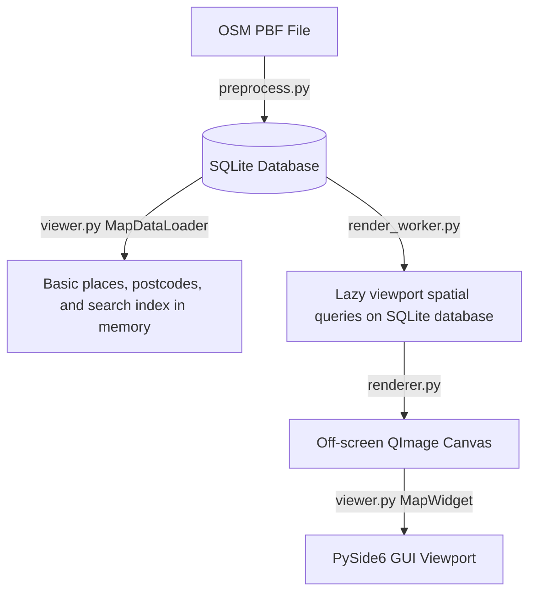

# Developer & Implementation Guide: Offline Map Viewer

> [!IMPORTANT]
> **CRITICAL PERSISTENT RULE: ALWAYS KEEP THIS GUIDE COMPREHENSIVE AND KEEP IT IN SYNC WITH THE CODEBASE.**
> *   **Do not make this guide minimalistic.** All technical details, format specifications (e.g., PBF Protocol Buffers and delta encoding), mathematical formulas, rendering pipelines, search structures, and extension guidelines must remain fully documented.
> *   **Do not delete or compact sections** without the user's explicit confirmation. If a component changes, update its description to match the new implementation instead of deleting or shortening the section.
> *   Whenever you modify styling rules, preprocessing pipelines, database schemas, lazy loading viewport queries, routing algorithms, `config.json` profiles, search systems, or rendering code, update this guide immediately.

---

## 1. Core Architecture Overview

The application is an offline map viewer that parses OpenStreetMap (OSM) data, compiles it into a lightweight SQLite database, and renders it interactively using Python and the PySide6 (Qt) framework.

The architecture uses a **lazy loading** design to make application startup instantaneous:


1.  **Preprocessing Layer (`preprocess.py`)**: Converts raw OSM PBF data into an optimized SQLite database (`.db`) containing raw nodes/ways (lossless copy) and processed rendering `ways`, `places`, `postcodes`, `routing_nodes`, and `routing_edges`.
2.  **Startup Loader (`viewer.py`: `MapDataLoader`)**: Only loads basic place metadata, postcodes, global bounding box bounds, and search items into memory. Bypasses loading dense coordinates, keeping startup load time under 200ms.
3.  **Background Render Worker (`render_worker.py`)**: On viewport changes, queries visible vector lines/polygons directly from SQLite utilizing the `idx_ways_bbox` index, simplifies coordinates on-the-fly, and feeds them to the renderer.
4.  **Rendering Layer (`renderer.py`)**: Renders visible vector geometries and text labels onto an off-screen `QImage` canvas.
5.  **Pathfinding Engine (`routing_worker.py`)**: Computes shortest/fastest paths using A* pathfinding. The routing graph is loaded into memory lazily when the first route is requested.

---

## 2. Domain-Specific Concepts & Terminology

### A. OpenStreetMap (OSM) Data Model
OSM represents geographical features using three primitive elements:
*   **Nodes**: Points on the Earth's surface defined by a unique ID, latitude, and longitude.
*   **Ways**: Ordered lists of node IDs representing linear features (roads, railways, rivers) or closed boundaries/areas (forests, lakes, bogs).
*   **Relations**: Groups of nodes, ways, or other relations with specific roles. They represent complex, non-contiguous features, such as multipolygon forests or administrative boundaries.

### B. Web Mercator Projection (EPSG:3857)
To display a spherical Earth on a flat 2D screen, latitude and longitude must be projected into flat coordinates in meters (X and Y). The project uses **Web Mercator**, which scales the coordinates based on the Earth's radius:
*   **X Coordinate**: Mapped linearly from longitude:
    $$x = \text{lon} \times \left(\frac{\pi}{180}\right) \times 6378137.0$$
*   **Y Coordinate**: Scaled non-linearly near the poles due to spherical distortion:
    $$y = \ln\left(\tan\left(\frac{\pi}{4} + \frac{\text{lat} \times \pi}{360}\right)\right) \times 6378137.0$$

These coordinates are computed using functions in [utils.py](file:///c:/Work/Maps/utils.py):
*   `project_mercator(lat, lon)`: Converts Latitude/Longitude to Mercator meters.
*   `inverse_mercator(x, y)`: Converts Mercator meters back to Latitude/Longitude.

### C. Loop Stitching
OSM files store ways as disconnected, random segments. To render long continuous roads, rivers, or railways without visual gaps and enable clean text labeling, we connect matching endpoints.
*   **Method**: `stitch_node_loops(node_lists)` (in [utils.py](file:///c:/Work/Maps/utils.py)) takes a list of lists of node IDs, finds segments that share start/end node IDs, and merges them into continuous paths.

### D. OpenStreetMap PBF Data Format
The `.osm.pbf` file format is a highly compressed binary representation of OSM data using Google Protocol Buffers. It is organized into independent blocks:
*   **HeaderBlock**: Metadata about the file (boundaries, software, required parser features).
*   **PrimitiveBlock**: Contains actual geographical elements (Nodes, Ways, Relations) and is structured to optimize storage space:
    *   **StringTable**: An array of strings used inside the block. Keys, values, and usernames are stored once and referenced by a 0-based index to prevent duplicate string storage.
    *   **DenseNodes**: Nodes are grouped and compressed using **delta encoding**. Rather than absolute coordinate values (which require many bytes), the format stores differences between consecutive node IDs and coordinates:
        *   $$\Delta x_i = x_i - x_{i-1}$$
        *   $$\Delta y_i = y_i - y_{i-1}$$
        This saves a significant amount of bytes since neighboring nodes have small relative differences. Coordinates are also scaled to 64-bit integers.
    *   **Ways & Relations**: Stored as lists of node references or member IDs, which also utilize delta encoding.
*   **Parsing in Python**: Read iteratively using the `osmiter` library. In this project, `osmiter` is used to stream elements block-by-block to keep memory usage low. In addition to parsing `.osm.pbf` and `.osm` (XML) files, `osmiter` supports reading from custom file-like objects. We leverage this feature by wrapping the raw file stream in a custom `ProgressFileWrapper` object, which intercepts reads to calculate and report real-time parsing progress (0-100%) to the GUI.

---

## 3. Database Schema

The SQLite database contains:

### A. Processed Tables (Used for Rendering)
#### 1. `ways`
Stores all vector line and polygon geometries.
*   `id` (INTEGER, Primary Key): Unique identifier.
*   `feature_type` (TEXT): Classification: `'coastline'`, `'forest'`, `'wetland'`, `'waterbody'`, `'river'`, `'highway'`, `'railway'`, or `'boundary'`.
*   `sub_type` (TEXT): Sub-classification (e.g. `'primary'` for roads).
*   `name` (TEXT): The name of the feature (if any).
*   `min_x`, `min_y`, `max_x`, `max_y` (REAL): The Mercator bounding box of the geometry, used for fast spatial query bounding.
*   `coords` (BLOB): Binary blob containing an array of double-precision floats (`d` type) representing Mercator coordinates in the format `[X1, Y1, X2, Y2, ...]`.

#### 2. `places`
Stores cities, towns, villages, and computed county labels.
*   `id` (INTEGER, Primary Key): Unique identifier.
*   `name` (TEXT): Name of the place.
*   `place_type` (TEXT): `'city'`, `'town'`, `'village'`, or `'county'`.
*   `x`, `y` (REAL): Mercator center coordinates.
*   `population` (INTEGER): Population value.

#### 3. `routing_nodes`
Stores junctions (intersections and endpoints) of drivable highways.
*   `id` (INTEGER, Primary Key): OSM Node ID of the junction.
*   `x`, `y` (REAL): Mercator center coordinates.

#### 4. `routing_edges`
Stores road segments between junctions.
*   `id` (INTEGER PRIMARY KEY AUTOINCREMENT)
*   `from_node` (INTEGER): Starting junction.
*   `to_node` (INTEGER): Ending junction.
*   `length` (REAL): Segment length in meters.
*   `way_type` (TEXT): Highway sub-class.
*   `name` (TEXT): Name of the street.
*   `oneway` (INTEGER): One-way status: `0` (two-way), `1` (one-way from $\to$ to), `-1` (one-way to $\to$ from).
*   `coords` (BLOB): Binary double BLOB of path coordinates.

---

## 4. Routing Profile System

Routing calculations are governed by profiles defined inside [config.json](file:///c:/Work/Maps/config.json). Each profile specifies:
*   `use_speed` (bool): If true, edge cost is calculated as time (seconds). If false, edge cost is calculated as distance (meters).
*   `speeds` (dict): Defines average speed (km/h) per road category.
*   `multipliers` (dict): Defines priority cost multipliers per road category.

The A* pathfinding algorithm calculates the cost of traversing an edge using:
$$\text{cost} = \left(\frac{\text{length}}{\text{speed\_mps}}\right) \times \text{multiplier}$$
(where $\text{speed\_mps}$ defaults to $1.0$ m/s if `use_speed` is false).

---

## 5. Search & Autocomplete Architecture

The viewer includes an incremental autocomplete search feature that queries places, Eircodes (postcodes), and named road/waterway features.

### A. Autocomplete Index Construction
In `MapDataLoader.run()`, we construct a sorted list of name-to-description tuples (`search_items`) for autocomplete:
1.  **Places**: Loops over loaded cities, towns, and villages. If a county is associated with it, we construct a description: `"Name, Co. County"`.
2.  **Postcodes**: Loops over unique Eircodes in the `postcodes` table and yields `"Postcode (Postcode)"`.
3.  **Ways**: Selects all named road/river features. To provide context, we perform a **spatial grid proximity search** to find the nearest city/town in memory, producing a description like `"Road Name, City Name, Co. County"`.
4.  **Autocompletion Dispatch**: The list is sorted alphabetically and loaded into a `QCompleter` attached to the GUI search box.

### B. Viewport Centering & Scale Allocation
When the user submits a search string, `search_place()` handles positioning in three steps:
1.  **Postcode Parsing**: Standardizes search queries (removes spaces, converts to uppercase).
    *   Queries `postcodes` for an exact match. If found, centers on it and zooms close (`scale = 0.1`).
    *   If no exact match exists, checks if it is a 7-character Eircode (e.g. `R32CH9D`), extracts the 3-character routing key prefix (e.g. `R32`), and averages the coordinates of all matching Eircode prefixes in the database.
2.  **Place Name Scoping**:
    *   Extracts base name and matches against loaded places. If county info is provided in the query (split by comma), filters for the matching county.
    *   Sets camera center to the place coordinate. Adjusts scale according to type: cities zoom out (`0.05`), towns zoom closer (`0.1`), villages zoom very close (`0.25`).
3.  **Proximity Sorting on Named Features**:
    *   If query matches a way, reads up to 200 matching ways from SQLite.
    *   Resolves a reference coordinate to sort candidates: if the search input included a town name (e.g. `Dublin Road, Athlone`), looks up the town's centroid; otherwise, uses the current viewport center.
    *   Calculates squared Euclidean distance from each way's centroid to this reference point and sorts.
    *   Centers the camera on the closest way and dynamically adjusts the zoom scale to fit the way's bounding box:
        $$\text{fit\_scale} = \frac{\min(\text{Viewport Width}, \text{Viewport Height})}{\max(\text{Way Width}, \text{Way Height})}$$

---

## 6. Major Functions Deep Dive

### A. Preprocessing (`preprocess.py`: `run_preprocess`)
1.  **PRAGMA settings**: Connects to SQLite and optimizes pragmas for bulk insertions.
2.  **Pass 1 Scan**: Iterates PBF. Writes nodes/ways to raw tables. Extracts places and boundaries.
3.  **Loop Stitching**: Runs `stitch_node_loops` on highway, railway, and river lists.
4.  **Pass 2 Scan**: Iterates PBF nodes again to resolve coordinates for used nodes.
5.  **Graph Compilation**: Segment ways at junctions, parse one-ways, compute lengths, write to `routing_nodes` and `routing_edges`.
6.  **Database insertion**: Writes stitched geometries and county centroids to SQLite.
7.  **Centroids and Indexes**: Creates indices on viewport bounding boxes and types.

### B. Off-Screen Canvas Rendering (`renderer.py`: `render_map`)
Renders vector layers onto a `QImage` canvas using pre-filtered and pre-simplified data provided by the background worker:
1.  **LOD Details Resolution**: Selects the scale key (e.g. `0.003` or `0.01`) that matches or is less than the current viewport scale.
2.  **Drawing Pipeline**:
    *   **Matrix transformation**: Translates coordinates by `width/2` and `height/2` to center the camera, and scales by `scale` and `-scale` (since screen Y goes down but Mercator Y goes up).
    *   **Renders polygons**: Coastlines (land mass), forests, wetlands, and waterbodies using custom solid-pattern brushes (`QBrush`) to avoid Preset gradient overload bugs in PySide6.
    *   **Renders lines**: Rivers, administrative boundaries (uses custom pens with `Qt.DashDotLine` or `Qt.DashLine`), and railways (draws a solid grey base line, then a dashed light line on top to resemble tracks).
    *   **Renders roads**: Skips casings for minor paths (`track`, `path`, etc.) and draws them with `Qt.DashLine`. Draws casings (width + 1.2px) for normal roads, followed by road cores.
3.  **Text Labeling**: Runs a collision avoidance grid (split into 80x80px cells). Cities, towns, and county centroids are labeled. If a cell is unoccupied, the label is drawn and the cell is marked. Rotated labels are placed on linear roads/rivers by calculating segment angles and positioning the text aligned with the path orientation.

### C. Background Render Worker (`render_worker.py`: `MapRenderWorker.run`)
Runs in a background thread on viewport changes to fetch only visible features from SQLite, preventing GUI freezes during scroll and zoom:
1.  **Viewport Spatial Query**: Computes the Mercator bounding box of the current screen view. Queries the SQLite `ways` table using a bounding box filter:
    `WHERE NOT (max_x < vx1 OR min_x > vx2 OR max_y < vy1 OR min_y > vy2)`
2.  **LOD Filtering**: Filters out features that are too small for the current zoom scale (e.g. minor roads at high zoom levels, or small boundaries).
3.  **On-the-fly Simplification**: Simplifies visible geometries using the Douglas-Peucker algorithm before sending them to the renderer.

### D. Async Map Loader (`viewer.py`: `MapDataLoader.run`)
Loads SQLite tables into memory during startup:
1.  **Table verification**: Verifies tables exist, loads configuration bounds, and indexes Eircodes.
2.  **Startup Optimization**: Only loads basic place metadata, postcodes, global bounding box bounds, and search items into memory. Coordinates are left in SQLite, keeping startup load times under 200ms.
3.  **Search Index**: Loops over places, ways, and Eircodes to build the autocomplete lookup list, executing spatial nearest-neighbor searches in memory to bind roads to their nearest towns.
4.  **Autocomplete Suffix Expansion**: For places of type `"station"`, dynamically generates variations like `"Name Station"` and `"Name Train Station"` in-memory to populate autocomplete suggestions.

### E. Spatial Query Indexing (`viewer.py`: `SpatialGridIndex` / SQLite Spatial Index)
The application transitioned from an in-memory spatial index to a database-driven index to handle large datasets efficiently:
1.  **In-Memory Spatial Grid (Deprecated `SpatialGridIndex`)**: Originally, the application subdivided the global bounding box of Ireland into a matrix of columns and rows (e.g. 24x24 for forests, 32x32 for roads). Each cell held an array of elements. Geometries were mapped to cell overlaps using:
    $$\text{col\_start} = \lfloor(min\_x - \text{grid\_min\_x}) / \text{cell\_width}\rfloor$$
    Viewport queries were resolved in $O(1)$ by translating screen boundaries to cell ranges and returning a unique set of elements.
2.  **Database Spatial Index (Active)**: In the current architecture, spatial queries are handled by SQLite database indices (`idx_ways_bbox` on `min_x`, `min_y`, `max_x`, `max_y`). The background worker executes bounding box overlap checks in SQLite. This removes the need to load millions of coordinates into memory at startup, saving RAM and eliminating start latency.

### F. Lazy Routing Loader (`routing_worker.py`: `RoutingWorker.run` / `find_route_astar`)
1.  **Graph Load**: If `routing_graph` is not cached in the map widget, query SQLite for all nodes/edges on-the-fly.
2.  **Edge Snapping**: Snap the clicked start and end coordinate pins to their nearest local road *edges* (instead of just junction nodes) by querying routing nodes and connected edges within a local bounding box (2 km, expanding if necessary).
3.  **Virtual Nodes (-1 / -2)**: Project the coordinates onto the nearest edges and inject virtual nodes `-1` (start) and `-2` (end) into a cloned in-memory representation of the routing graph, splitting the edges into virtual sub-segments with ratios of their original lengths.
4.  **Min-Heap A***: Solves the path between virtual nodes `-1` and `-2` using Euclidean distance to target as a heuristic.
5.  **Geometry Trimming**: Reconstructs the complete route edge sequence, concatenates their geometries, and trims the path ends to begin exactly at pin A and end exactly at pin B.

---

## 7. Guide to Extending the App

### A. How to Add a New Line/Polygon Feature (e.g., Powerlines)
1.  **Update [rules.py](file:///c:/Work/Maps/rules.py)**: Create a helper function checking for the tag (e.g., `is_powerline(power)`).
2.  **Update [preprocess.py](file:///c:/Work/Maps/preprocess.py)**:
    *   In Pass 1, check `tags.get("power")`. If it is a powerline, add it to a list and record referenced nodes in `needed_nodes`.
    *   During the save step, write it to the `ways` table with `feature_type = 'powerline'`.
3.  **Update [render_worker.py](file:///c:/Work/Maps/render_worker.py)**:
    *   In `MapRenderWorker.run()`, initialize a list for `powerlines` inside `render_data`.
    *   In the row retrieval loop, check if `ftype == "powerline"`. Append the parsed `MapPolygon` item to `render_data["powerlines"]`.
4.  **Update [renderer.py](file:///c:/Work/Maps/renderer.py)**:
    *   In `render_map()`, fetch the visible powerlines from `render_data["powerlines"]`.
    *   Draw the features onto the canvas using `painter.drawPolyline()` (for lines) or `painter.drawPolygon()` (for areas) with a custom QPen/QBrush color.

### B. Adjusting Zoom Visibility Thresholds
If you want administrative boundaries to become visible earlier, edit [render_worker.py](file:///c:/Work/Maps/render_worker.py#L113-L119):
```python
# Adjust the scale check threshold from 0.003 to 0.001
elif ftype == "boundary":
    if sub_type == '2':
        if self.scale < 0.0004:
            continue
    else:
        if self.scale < 0.001:  # Was 0.003
            continue
```
To adjust road drawing scales, modify `zoom_details` inside [constants.py](file:///c:/Work/Maps/constants.py#L51-L58) or [dev_settings.json](file:///c:/Work/Maps/dev_settings.json#L33-L64).

