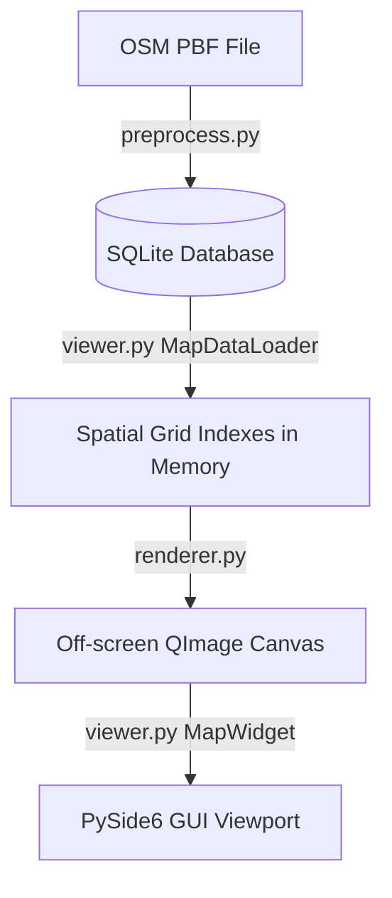

# Developer & Implementation Guide: Offline Map Viewer

> [!IMPORTANT]
> **Documentation Synchronization Notice**: This developer guide must be kept in sync with the codebase. Whenever you make modifications to styling rules, preprocessing pipelines, database schemas, spatial grid indexes, search systems, or rendering processes, update this document accordingly.

---

## 1. Core Architecture Overview

The application is an offline map viewer that parses OpenStreetMap (OSM) data, compiles it into a lightweight SQLite database, and renders it interactively using Python and the PySide6 (Qt) framework.

The architecture is divided into three layers:


1. **Preprocessing Layer (`preprocess.py`)**: Converts raw OSM PBF data into an optimized SQLite database (`.db`).
2. **Data Indexing Layer (`viewer.py`)**: Loads processed map data from SQLite and indexes it in memory using a custom 2D Spatial Grid Index.
3. **Rendering Layer (`renderer.py`)**: Renders visible vector lines, polygons, and labels onto an off-screen `QImage` canvas based on the current camera viewport and zoom scale.

---

## 2. Domain-Specific Concepts & Terminology

### A. OpenStreetMap (OSM) Data Model
OSM represents geographical features using three primitive elements:
*   **Nodes**: Points on the Earth's surface defined by a unique ID, latitude, and longitude.
*   **Ways**: Ordered lists of node IDs representing linear features (roads, railways, rivers) or closed boundaries/areas (forests, lakes, bogs).
*   **Relations**: Groups of nodes, ways, or other relations with specific roles. They represent complex, non-contiguous features, such as multipolygon forests or **administrative boundaries** (e.g. county borders) where separate ways represent individual border segments.

### B. Web Mercator Projection (EPSG:3857)
To display a spherical Earth on a flat 2D screen, latitude and longitude must be projected into flat coordinates in meters (X and Y). The project uses **Web Mercator**, which scales the coordinates based on the Earth's radius:
*   **X Coordinate**: Mapped linearly from longitude:
    $$x = \text{lon} \times \left(\frac{\pi}{180}\right) \times 6378137.0$$
*   **Y Coordinate**: Scaled non-linearly near the poles due to spherical distortion:
    $$y = \ln\left(\tan\left(\frac{\pi}{4} + \frac{\text{lat} \times \pi}{360}\right)\right) \times 6378137.0$$

These coordinates are computed using functions in [utils.py](file:///c:/Work/Maps/utils.py):
*   `project_mercator(lat, lon)`: Converts Latitude/Longitude to Mercator meters.
*   `inverse_mercator(x, y)`: Converts Mercator meters back to Latitude/Longitude.

### C. Loop Stitching
OSM files store ways as disconnected, random segments. To render long continuous roads, rivers, or railways without visual gaps and enable clean text labeling, we connect matching endpoints.
*   **Method**: `stitch_node_loops(node_lists)` (in [utils.py](file:///c:/Work/Maps/utils.py)) takes a list of lists of node IDs, finds segments that share start/end node IDs, and merges them into continuous paths.

### D. OpenStreetMap PBF Data Format
The `.osm.pbf` file format is a highly compressed binary representation of OSM data using Google Protocol Buffers. It is organized into independent blocks:
*   **HeaderBlock**: Metadata about the file (boundaries, software, required parser features).
*   **PrimitiveBlock**: Contains actual geographical elements (Nodes, Ways, Relations) and is structured to optimize storage space:
    *   **StringTable**: An array of strings used inside the block. Keys, values, and usernames are stored once and referenced by a 0-based index to prevent duplicate string storage.
    *   **DenseNodes**: Nodes are grouped and compressed using **delta encoding**. Rather than absolute coordinate values (which require many bytes), the format stores differences between consecutive node IDs and coordinates:
        *   $$\Delta x_i = x_i - x_{i-1}$$
        *   $$\Delta y_i = y_i - y_{i-1}$$
        This saves a significant amount of bytes since neighboring nodes have small relative differences. Coordinates are also scaled to 64-bit integers.
    *   **Ways & Relations**: Stored as lists of node references or member IDs, which also utilize delta encoding.
*   **Parsing in Python**: Read iteratively using the `osmiter` library. In this project, `osmiter` is used to stream elements block-by-block to keep memory usage low. In addition to parsing `.osm.pbf` and `.osm` (XML) files, `osmiter` supports reading from custom file-like objects. We leverage this feature by wrapping the raw file stream in a custom `ProgressFileWrapper` object, which intercepts reads to calculate and report real-time parsing progress (0-100%) to the GUI.

---

## 3. Database Schema

The SQLite database (`ireland-and-northern-ireland-260603.db`) contains two types of tables: **raw data tables** (temporary storage for lossless import) and **processed tables** (queried by the viewer).

### A. Processed Tables (Used for Rendering)
#### 1. `ways`
Stores all vector line and polygon geometries.
*   `id` (INTEGER, Primary Key): Unique identifier for the way.
*   `feature_type` (TEXT): General classification: `'coastline'`, `'forest'`, `'wetland'`, `'waterbody'`, `'river'`, `'highway'`, `'railway'`, or `'boundary'`.
*   `sub_type` (TEXT): Sub-classification (e.g., `'primary'` for roads, `'rail'` for railways, `'6'` for county borders).
*   `name` (TEXT): The name of the feature (if any).
*   `min_x`, `min_y`, `max_x`, `max_y` (REAL): The Mercator bounding box of the geometry, used for fast spatial query bounding.
*   `coords` (BLOB): Binary blob containing an array of double-precision floats (`d` type) representing Mercator coordinates in the format `[X1, Y1, X2, Y2, ...]`.

#### 2. `places`
Stores cities, towns, villages, and computed county labels.
*   `id` (INTEGER, Primary Key): Unique identifier (custom negative IDs for county centroids).
*   `name` (TEXT): Name of the place (e.g. `"Athlone"`, `"County Wicklow"`).
*   `place_type` (TEXT): `'city'`, `'town'`, `'village'`, or `'county'`.
*   `x`, `y` (REAL): Mercator center coordinates.
*   `population` (INTEGER): Population value (counties are set to `99999999` to ensure high-priority drawing).

#### 3. `config`
Stores metadata keys (e.g., `"bbox"` containing the global map bounding box in JSON).

---

## 4. Search & Autocomplete Architecture

The viewer includes an incremental autocomplete search feature that queries places, Eircodes (postcodes), and named road/waterway features.

### A. Autocomplete Index Construction
In `MapDataLoader.run()`, we construct a sorted list of name-to-description tuples (`search_items`) for autocomplete:
1.  **Places**: Loops over loaded cities, towns, and villages. If a county is associated with it, we construct a description: `"Name, Co. County"`.
2.  **Postcodes**: Loops over unique Eircodes in the `postcodes` table and yields `"Postcode (Postcode)"`.
3.  **Ways**: Selects all named road/river features. To provide context, we perform a **spatial grid proximity search** to find the nearest city/town in memory, producing a description like `"Road Name, City Name, Co. County"`.
4.  **Autocompletion Dispatch**: The list is sorted alphabetically and loaded into a `QCompleter` attached to the GUI search box.

### B. Viewport Centering & Scale Allocation
When the user submits a search string, `search_place()` handles positioning in three steps:
1.  **Postcode Parsing**: Standardizes search queries (removes spaces, converts to uppercase).
    *   Queries `postcodes` for an exact match. If found, centers on it and zooms close (`scale = 0.1`).
    *   If no exact match exists, checks if it is a 7-character Eircode (e.g. `R32CH9D`), extracts the 3-character routing key prefix (e.g. `R32`), and averages the coordinates of all matching Eircode prefixes in the database.
2.  **Place Name Scoping**:
    *   Extracts base name and matches against loaded places. If county info is provided in the query (split by comma), filters for the matching county.
    *   Sets camera center to the place coordinate. Adjusts scale according to type: cities zoom out (`0.05`), towns zoom closer (`0.1`), villages zoom very close (`0.25`).
3.  **Proximity Sorting on Named Features**:
    *   If query matches a way, reads up to 200 matching ways from SQLite.
    *   Resolves a reference coordinate to sort candidates: if the search input included a town name (e.g. `Dublin Road, Athlone`), looks up the town's centroid; otherwise, uses the current viewport center.
    *   Calculates squared Euclidean distance from each way's centroid to this reference point and sorts.
    *   Centers the camera on the closest way and dynamically adjusts the zoom scale to fit the way's bounding box:
        $$\text{fit\_scale} = \frac{\min(\text{Viewport Width}, \text{Viewport Height})}{\max(\text{Way Width}, \text{Way Height})}$$

---

## 5. Major Functions Deep Dive

### A. Preprocessing (`preprocess.py`: `run_preprocess`)
This function builds the optimized DB from the source PBF.
1.  **PRAGMA settings**: Connects to SQLite and turns off synchronous writes (`PRAGMA synchronous=OFF`) and WAL journaling (`PRAGMA journal_mode=WAL`) to accelerate bulk insertions.
2.  **Pass 1 Scan**: Iterates through PBF nodes, ways, and relations.
    *   Nodes: Bulk-inserts places (city/town/village) into memory and stores raw coordinates in `raw_nodes`.
    *   Ways: Checks if the tags contain whitelisted keys (coastlines, highways, railways, rivers, wetlands, forests, lakes). If so, adds node IDs to `needed_nodes` and stores segments.
    *   Relations: Bulk-inserts members into `raw_relations`.
3.  **Boundary extraction**: Queries the committed `raw_relations` table for administrative boundaries (levels 2, 4, 6). Collects their member way IDs, reads their node lists, adds the nodes to `needed_nodes`, and adds the boundary segments to `kept_ways`.
4.  **Loop Stitching**: Runs `stitch_node_loops` on highway, railway, and river lists in memory to connect raw segments into long continuous lines.
5.  **Pass 2 Scan**: Iterates through PBF nodes again. If a node's ID is in `needed_nodes`, projects its lat/lon into Mercator coordinates and saves it to a dictionary (`node_coords`).
6.  **Database insertion**: Writes stitched geometries to the `ways` table. Converts coordinate float arrays into binary double-precision blobs (`struct.pack` using `d` format) to reduce DB size and load latency.
7.  **Centroids and Indexes**:
    *   Calculates county centroids by averaging the coordinates of all boundary nodes and saves them in `places`.
    *   Creates spatial SQLite indices (`CREATE INDEX`) on bounding boxes and feature types.

### B. Off-Screen Canvas Rendering (`renderer.py`: `render_map`)
Renders vector layers onto a `QImage` canvas.
1.  **LOD Scaling Key**: Selects the scale key (e.g. `0.003` or `0.01`) that matches or is less than the current viewport scale.
2.  **Viewport Spatial Query**: Computes the Mercator bounding box of the current screen view. Queries each spatial index grid to retrieve only the features that overlap the viewport.
3.  **Coordinate Budgeting**: Counts the total vertex count of visible items. If it exceeds the CPU capacity benchmark budget, drops down to a coarser scale key (with higher simplification tolerance) iteratively until the total point count fits the budget.
4.  **Drawing Pipeline**:
    *   Matrix transformation: Translates coordinates by `width/2` and `height/2` to center the camera, and scales by `scale` and `-scale` (since screen Y goes down but Mercator Y goes up).
    *   Renders polygons: Coastlines (land mass), forests, wetlands, and waterbodies.
    *   Renders lines: Rivers, administrative boundaries (uses custom pens with `Qt.DashDotLine` or `Qt.DashLine`), and railways (draws a solid grey base line, then a dashed light line on top to resemble tracks).
    *   Renders roads: Skips casings for minor paths (`track`, `path`, etc.) and draws them with `Qt.DashLine`. Draws casings (width + 1.2px) for normal roads, followed by road cores.
5.  **Text Labeling**: Runs a collision avoidance grid (split into 80x80px cells). Cities, towns, and county centroids are labeled. If a cell is unoccupied, the label is drawn and the cell is marked. Rotated labels are placed on linear roads/rivers by calculating segment angles.

### C. Async Map Loader (`viewer.py`: `MapDataLoader.run`)
Loads SQLite tables into memory during startup:
1.  **Table verification**: Verifies tables exist, loads configuration bounds, and indexes Eircodes.
2.  **Spatial index initialization**: Creates `SpatialGridIndex` grids for each of the 6 scale keys.
3.  **Geometry Parsing**:
    *   Queries ways, coastlines, waterbodies, bogs, forests, and roads.
    *   Reads the binary coordinate `BLOB` from the database row, unpacks it using `array.array('d', blob)` for maximum conversion speed, and converts it to a `QPolygonF` object.
    *   For each zoom scale, if simplification is enabled, simplifies geometry coordinates using the Douglas-Peucker algorithm and caches the simplified `QPolygonF`.
    *   Adds geometries to the grid index cells matching their bounding box coordinates.
4.  **Search Index**: Loops over places and ways to build the autocomplete lookup list, executing spatial nearest-neighbor searches to bind roads to towns.

### D. Spatial Grid Index (`viewer.py`: `SpatialGridIndex`)
A high-performance grid index that manages objects in 2D space.
1.  **Initialization**: Divides the global bounding box of Ireland into a matrix of columns and rows (e.g. 24x24 for forests, 32x32 for roads). Each cell is initialized as an empty Python list.
2.  **`add(item, min_x, min_y, max_x, max_y)`**: Calculates the column and row ranges that overlap the item's bounding box:
    $$\text{col\_start} = \lfloor(min\_x - \text{grid\_min\_x}) / \text{cell\_width}\rfloor$$
    Appends the item reference to all lists in this range.
3.  **`query(viewport_rect)`**: Converts the screen coordinates back to grid column and row indices. Gathers and merges the lists of these cells into a Python `set` to eliminate duplicates, returning all visible candidate features in $O(1)$ cell lookups.

---

## 6. Guide to Extending the App

### A. How to Add a New Line/Polygon Feature (e.g., Powerlines)
1.  **Update [rules.py](file:///c:/Work/Maps/rules.py)**: Create a helper function checking for the tag (e.g. `is_powerline(power)`).
2.  **Update [preprocess.py](file:///c:/Work/Maps/preprocess.py)**:
    *   In Pass 1, check `tags.get("power")`. If it is a powerline, add it to a list and record referenced nodes in `needed_nodes`.
    *   During the save step, write it to the `ways` table with `feature_type = 'powerline'`.
3.  **Update [viewer.py](file:///c:/Work/Maps/viewer.py)**:
    *   In `MapDataLoader.run()`, initialize a `powerlines_index`.
    *   Query `WHERE feature_type='powerline'` and load it into the index. Add `powerlines_index` to the returned `data` dictionary.
    *   In `MapWidget`, store the index and pass it to `map_data` inside `trigger_background_render()`.
4.  **Update [renderer.py](file:///c:/Work/Maps/renderer.py)**:
    *   Query visible powerlines, budget points, and define a QPen style (e.g., thin grey line with custom dots). Draw them using `painter.drawPolyline()`.

### B. Adjusting Zoom Visibility Thresholds
If you want administrative boundaries to become visible earlier, edit [viewer.py](file:///c:/Work/Maps/viewer.py#L413-L429):
```python
# Change the scale check threshold from 0.003 to 0.001
if float(sk) >= 0.001:
    boundaries_index[sk].add(item, min_x, min_y, max_x, max_y)
```
To adjust road drawing scales, modify `zoom_details` inside [constants.py](file:///c:/Work/Maps/constants.py#L51-L58) or [dev_settings.json](file:///c:/Work/Maps/dev_settings.json#L33-L64).
