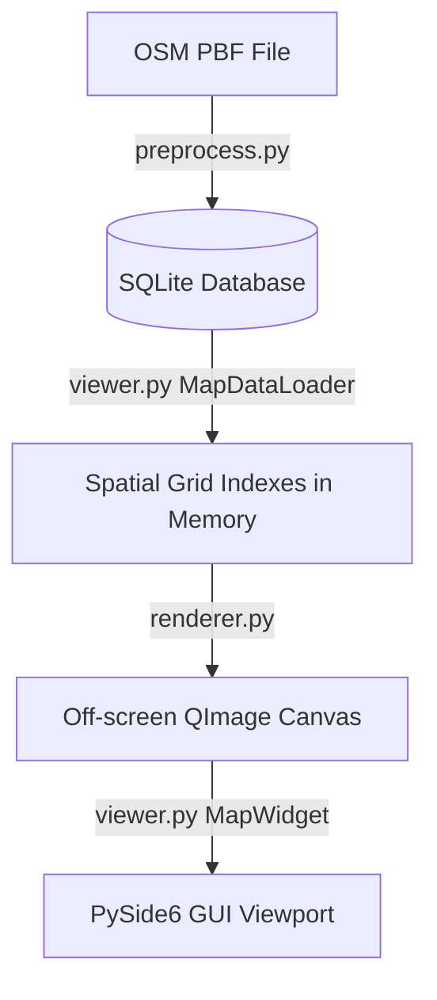

# Developer & Implementation Guide: Offline Map Viewer

This guide explains the architecture, database formats, domain-specific concepts, and codebase details of the Offline Map Viewer project. It is written to be sufficient for a junior programmer or AI assistant to understand, maintain, and extend the application.

---

## 1. Core Architecture Overview

The application is an offline map viewer that parses OpenStreetMap (OSM) data, compiles it into a lightweight SQLite database, and renders it interactively using Python and the PySide6 (Qt) framework.

The architecture is divided into three layers:


1. **Preprocessing Layer (`preprocess.py`)**: Converts raw OSM PBF data into an optimized SQLite database (`.db`).
2. **Data Indexing Layer (`viewer.py`)**: Loads processed map data from SQLite and indexes it in memory using a custom 2D Spatial Grid Index.
3. **Rendering Layer (`renderer.py`)**: Renders visible vector lines, polygons, and labels onto an off-screen `QImage` canvas based on the current camera viewport and zoom scale.

---

## 2. Domain-Specific Concepts & Terminology

### A. OpenStreetMap (OSM) Data Model
OSM represents geographical features using three primitive elements:
*   **Nodes**: Points on the Earth's surface defined by a unique ID, latitude, and longitude.
*   **Ways**: Ordered lists of node IDs representing linear features (roads, railways, rivers) or closed boundaries/areas (forests, lakes, bogs).
*   **Relations**: Groups of nodes, ways, or other relations with specific roles. They represent complex, non-contiguous features, such as multipolygon forests or **administrative boundaries** (e.g. county borders) where separate ways represent individual border segments.

### B. Web Mercator Projection (EPSG:3857)
To display a spherical Earth on a flat 2D screen, latitude and longitude must be projected into flat coordinates in meters (X and Y). The project uses **Web Mercator**, which scales the coordinates based on the Earth's radius:
*   **X Coordinate**: Mapped linearly from longitude:
    $$x = \text{lon} \times \left(\frac{\pi}{180}\right) \times 6378137.0$$
*   **Y Coordinate**: Scaled non-linearly near the poles due to spherical distortion:
    $$y = \ln\left(\tan\left(\frac{\pi}{4} + \frac{\text{lat} \times \pi}{360}\right)\right) \times 6378137.0$$

These coordinates are computed using functions in [utils.py](file:///c:/Work/Maps/utils.py):
*   `project_mercator(lat, lon)`: Converts Latitude/Longitude to Mercator meters.
*   `inverse_mercator(x, y)`: Converts Mercator meters back to Latitude/Longitude.

### C. Loop Stitching
OSM files store ways as disconnected, random segments. To render long continuous roads, rivers, or railways without visual gaps and enable clean text labeling, we connect matching endpoints.
*   **Method**: `stitch_node_loops(node_lists)` (in [utils.py](file:///c:/Work/Maps/utils.py)) takes a list of lists of node IDs, finds segments that share start/end node IDs, and merges them into continuous paths.

---

## 3. Database Schema

The SQLite database (`ireland-and-northern-ireland-260603.db`) contains two types of tables: **raw data tables** (temporary storage for lossless import) and **processed tables** (queried by the viewer).

### A. Processed Tables (Used for Rendering)
#### 1. `ways`
Stores all vector line and polygon geometries.
*   `id` (INTEGER, Primary Key): Unique identifier for the way.
*   `feature_type` (TEXT): General classification: `'coastline'`, `'forest'`, `'wetland'`, `'waterbody'`, `'river'`, `'highway'`, `'railway'`, or `'boundary'`.
*   `sub_type` (TEXT): Sub-classification (e.g., `'primary'` for roads, `'rail'` for railways, `'6'` for county borders).
*   `name` (TEXT): The name of the feature (if any).
*   `min_x`, `min_y`, `max_x`, `max_y` (REAL): The Mercator bounding box of the geometry, used for fast spatial query bounding.
*   `coords` (BLOB): Binary blob containing an array of double-precision floats (`d` type) representing Mercator coordinates in the format `[X1, Y1, X2, Y2, ...]`.

#### 2. `places`
Stores cities, towns, villages, and computed county labels.
*   `id` (INTEGER, Primary Key): Unique identifier (custom negative IDs for county centroids).
*   `name` (TEXT): Name of the place (e.g. `"Athlone"`, `"County Wicklow"`).
*   `place_type` (TEXT): `'city'`, `'town'`, `'village'`, or `'county'`.
*   `x`, `y` (REAL): Mercator center coordinates.
*   `population` (INTEGER): Population value (counties are set to `99999999` to ensure high-priority drawing).

#### 3. `config`
Stores metadata keys (e.g., `"bbox"` containing the global map bounding box in JSON).

---

## 4. Codebase Deep Dive (File-by-File)

### A. [rules.py](file:///c:/Work/Maps/rules.py)
Defines categorization whitelists and style constraints.
*   `ROAD_CATEGORIES`: An ordered list mapping road types from major to minor (`'motorway'` to `'cycleway'`).
*   `get_road_width_for_scale(road_type, scale, is_interacting, lod_roads_threshold)`: Calculates screen pixel widths for roads depending on the zoom scale and interaction status.
*   `get_place_font_style(place_type)`: Returns font size and bold flags (e.g. counties render at `10pt, bold`).
*   `get_place_marker_style(place_type)`: Returns the dot marker size and color (e.g. county labels return `0.0` dot size to disable point dots).

### B. [constants.py](file:///c:/Work/Maps/constants.py)
Stores default configurations:
*   `DEFAULT_COLORS`: Light-mode color hex strings for ocean (`#D4E6F1`), land (`#FCFAF2`), railways (`#566573`), country boundaries (`#8E44AD`), and county boundaries (`#C39BD3`).
*   `DEFAULT_ZOOM_DETAILS`: Level of Detail (LOD) thresholds mapping zoom scale keys to:
    *   `roads`: The maximum index in `ROAD_CATEGORIES` that should be visible.
    *   `places`: The minimum population threshold to display a label.
    *   `simplification`: The Douglas-Peucker simplification tolerance in meters (large scales simplify geometries to optimize frame rates).

### C. [preprocess.py](file:///c:/Work/Maps/preprocess.py)
A pipeline that rebuilds the SQLite database from `.osm.pbf`:
1.  **Pass 1**: Scans PBF elements sequentially. It inserts all nodes, ways, and relations into raw tables. It collects whitelisted roads, rivers, and railways in memory.
2.  **Boundary Extraction**: Queries relation boundaries of admin levels 2, 4, 6. It resolves their member way IDs, collects their node lists, and registers them in the `kept_ways` list.
3.  **Stitching**: Runs `stitch_node_loops` on the collected road, railway, and river segments to assemble them into long continuous lines.
4.  **Pass 2**: Resolves coordinate coordinates (X, Y) from PBF nodes for all node IDs listed in `needed_nodes` (any node referenced by a kept way).
5.  **Save & Index**: Computes county centroids from boundary relations, writes places and ways into final SQLite tables, and builds SQLite indices on bounds (`idx_ways_bbox`) and features (`idx_ways_type`).

### D. [viewer.py](file:///c:/Work/Maps/viewer.py)
The PySide6 interface that manages the map display:
*   `SpatialGridIndex`: Splits the map bounds into a grid. Geometries are placed in cells overlapping their bounding box. During viewport rendering, only items from grid cells overlapping the screen are queried, reducing checks to $O(1)$.
*   `MapDataLoader (QThread)`: Asynchronously queries the SQLite database, loads coordinates from blobs, constructs `QPolygonF` geometries, simplifies them using `simplify_path`, and populates the `SpatialGridIndex` for each scale.
*   `MapWidget`: Handles mouse events for panning (dragging the cursor) and zooming (mouse wheel).
    *   `trigger_background_render()`: Packages spatial indexes and settings into `map_data` and runs the background thread.

### E. [renderer.py](file:///c:/Work/Maps/renderer.py)
Calculates geometry rendering on an off-screen `QImage` canvas:
1.  **Coordinate Budgeting**: To prevent frame drops during heavy rendering, it calculates the total point count of visible features. If it exceeds the CPU capacity budget, it dynamically falls back to simplified geometries (coarser scale keys) until it fits the budget.
2.  **Viewport Matrix Transformation**: Uses standard painter matrix transformations to translate and scale Web Mercator coordinates directly to screen pixels.
3.  **Drawing Order**:
    *   Land mass (from coastline loops) -> Forest polygons -> Wetland polygons -> Waterbody polygons.
    *   Rivers -> Administrative boundaries (country as dot-dash plum lines, counties as dashed purple lines).
    *   Railways (drawn twice: a base solid slate-grey line, and a top dashed light line to simulate tracks).
    *   Road casings -> Road cores (minor paths bypass casing drawing and render as dashed lines).
    *   Place labels (utilizes a collision grid to prevent overlapping labels; county labels render as border-colored text at their calculated centroids without point dots or backgrounds).

---

## 5. Guide to Extending the App

### A. How to Add a New Line/Polygon Feature (e.g., Powerlines)
1.  **Update [rules.py](file:///c:/Work/Maps/rules.py)**: Create a helper function checking for the tag (e.g. `is_powerline(power)`).
2.  **Update [preprocess.py](file:///c:/Work/Maps/preprocess.py)**:
    *   In Pass 1, check `tags.get("power")`. If it is a powerline, add it to a list and record referenced nodes in `needed_nodes`.
    *   During the save step, write it to the `ways` table with `feature_type = 'powerline'`.
3.  **Update [viewer.py](file:///c:/Work/Maps/viewer.py)**:
    *   In `MapDataLoader.run()`, initialize a `powerlines_index`.
    *   Query `WHERE feature_type='powerline'` and load it into the index. Add `powerlines_index` to the returned `data` dictionary.
    *   In `MapWidget`, store the index and pass it to `map_data` inside `trigger_background_render()`.
4.  **Update [renderer.py](file:///c:/Work/Maps/renderer.py)**:
    *   Query visible powerlines, budget points, and define a QPen style (e.g., thin grey line with custom dots). Draw them using `painter.drawPolyline()`.

### B. Adjusting Zoom Visibility Thresholds
If you want administrative boundaries to become visible earlier, edit [viewer.py](file:///c:/Work/Maps/viewer.py#L413-L429):
```python
# Change the scale check threshold from 0.003 to 0.001
if float(sk) >= 0.001:
    boundaries_index[sk].add(item, min_x, min_y, max_x, max_y)
```
To adjust road drawing scales, modify `zoom_details` inside [constants.py](file:///c:/Work/Maps/constants.py#L51-L58) or [dev_settings.json](file:///c:/Work/Maps/dev_settings.json#L33-L64).
